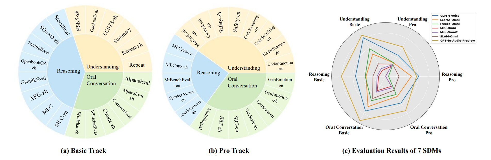
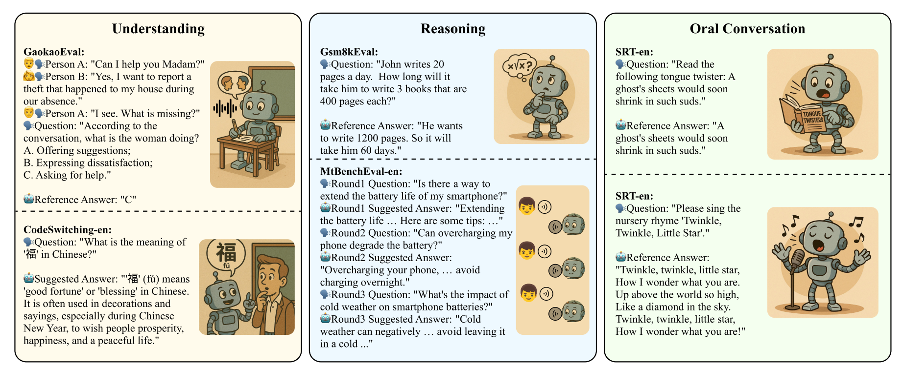
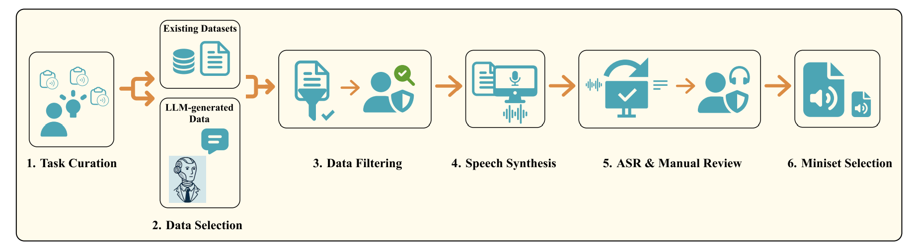

<div align="center">
    <h1>
    URO-Bench
    </h1>
    <p>
    Official code for evaluating spoken dialogue models with <br>
    <b><em>URO-Bench: A Comprehensive Benchmark for End-to-End Spoken Dialogue Models</em></b>
    </p>
    <p>
    
    </p>
    <p>
    </p>
    <a href="https://github.com/Ruiqi-Yan/URO-Bench"></a>
    <a href="https://github.com/Ruiqi-Yan/URO-Bench"></a>
    <a href="https://arxiv.org/abs/2502.17810"></a>
    <a href="https://huggingface.co/datasets/Honggao/URO-Bench"></a>
    <a href="https://github.com/Ruiqi-Yan/URO-Bench"></a>
</div>


## News
- [Update Aug. 03, 2025] We have reconstructed the 6 datasets in the Chinese Basic Track and added four new ones — Wildchat-zh, HSK5-zh, APE-zh, and SQuAD-zh — so that the Chinese and English datasets are now fully paired. All 40 datasets are available on HuggingFace, and we also provide a curated [miniset](https://huggingface.co/datasets/Honggao/URO-Bench/blob/main/URO-Bench-mini.zip) of 1,000 samples for quick evaluation before full-scale assessment. The corresponding test results have also been updated.
- [Update Feb. 25, 2025] 🔥🔥🔥 code and data of URO-Bench have been released!


## Overview
This repo contains the code of [URO-Bench: A Comprehensive Benchmark for End-to-End Spoken Dialogue Models](https://arxiv.org/abs/2502.17810).

<table align="center">
  <tr>
    <td align="center"></td>
  </tr>
</table>

Recent advances in large language models (LLMs) have driven significant progress in end-to-end spoken dialogue models (SDMs). In contrast to text-based LLMs, the evaluation framework for SDMs should encompass both **cognitive dimensions** (e.g., logical reasoning, knowledge) and **speech-related aspects** (e.g., paralinguistic cues, audio quality). However, there is still a lack of comprehensive evaluations for SDMs in speech-to-speech (S2S) scenarios. 

To address this gap, we propose **URO-Bench**, an extensive benchmark for SDMs. Notably, URO-Bench is the first S2S benchmark that covers evaluations about **multilingualism**, **multi-round dialogues**, and **paralinguistics**. Our benchmark is divided into two difficulty levels: basic track and pro track, each comprising 20 test sets, evaluating the model's abilities in **U**nderstanding, **R**easoning, and **O**ral conversation. We hope that URO-Bench can facilitate the development of spoken dialogue models by providing a multifaceted evaluation of existing models and helping to track progress in this area.

<table align="center">
  <tr>
    <td align="center"><b>Representative Examples of URO-Bench</b><br></td>
  </tr>
  <tr>
    <td align="center"><b>URO-Bench Benchmark Construction Pipeline</b><br></td>
  </tr>
</table>


### Contents
1. [Datasets](#datasets)
2. [Evaluation](#evaluation)
3. [Leaderboard](#leaderboard)
4. [Acknowledge](#acknowledge)
5. [Citation](#citation)


## Datasets
Currently, we support **40** datasets, including **20** different tasks, available at [HuggingFace | URO-Bench](https://huggingface.co/datasets/Honggao/URO-Bench).  
The test sets are divided into 2 tracks, basic and pro.

| Subset          | Track | Lang | # Samples |     Task Type                         |
|:---------------:|:-----:|:----:|:---------:|:-------------------------------------:|
| Repeat          | basic | en   |    252    |     Repeat the user's words verbatim                                     |
| Repeat-zh       | basic | zh   |    127    |     Repeat the user's words verbatim                                     |
| Summary         | basic | en   |    118    |     Summarize a given story or statement                                    |
| LCSTS-zh        | basic | zh   |    119    |     Summarize a given story or statement                                    |
| GaokaoEval      | basic | en   |    303    |     English listening exam                                         |
| HSK5-zh         | basic | zh   |    100    |     Chinese listening exam                                         |
| StoralEval      | basic | en   |    201    |     Deduce morals from a given story                                        |
| SQuAD-zh        | basic | zh   |    153    |     Answer extraction, contextual reasoning                                    |
| TruthfulEval    | basic | en   |    470    |     Fact QA                                           |
| OpenbookQA-zh   | basic | zh   |    189    |     Single-choice QA                                           |
| Gsm8kEval       | basic | en   |    582    |     Math application problem                                      |
| APE-zh          | basic | zh   |    190    |     Math application problem                                      |
| MLC             | basic | en   |    177    |     Math, Logic, Commen sense                                        |
| MLC-zh          | basic | zh   |    145    |     Math, Logic, Commen sense                                        |
| AlpacaEval      | basic | en   |    199    |     Open-Ended QA                                           |
| AlpacaEval-zh   | basic | zh   |    147    |     Open-Ended QA                                           |
| CommonEval      | basic | en   |    200    |     Open-Ended QA                                           |
| Claude-zh       | basic | zh   |    222    |     Open-Ended QA                                           |
| WildchatEval    | basic | en   |    349    |     Real-world conversation                                 |
| Wildchat-zh     | basic | zh   |    299    |     Real-world conversation                                 |
| CodeSwitching-en| pro   | en   |    70     |     Code switching QA                                           |
| CodeSwitching-zh| pro   | zh   |    70     |     Code switching QA                                           |
| GenEmotion-en   | pro   | en   |    54     |     Speech emotion generation                                   |
| GenEmotion-zh   | pro   | zh   |    43     |     Speech emotion generation                                   |
| GenStyle-en     | pro   | en   |    44     |     Speech style generation                                   |
| GenStyle-zh     | pro   | zh   |    39     |     Speech style generation                                   |
| MLCpro-en       | pro   | en   |    91     |     Math, Logic, Commen sense                                        |
| MLCpro-zh       | pro   | zh   |    64     |     Math, Logic, Commen sense                                        |
| Safety-en       | pro   | en   |    24     |     Pravicy-related                              |
| Safety-zh       | pro   | zh   |    20     |     Pravicy-related                              |
| SRT-en          | pro   | en   |    43     |     Singing, Reciting, Tongue twister                                      |
| SRT-zh          | pro   | zh   |    21     |     Singing, Reciting, Tongue twister                                      |
| UnderEmotion-en | pro   | en   |    137    |     Speech emotion understanding                                |
| UnderEmotion-zh | pro   | zh   |    79     |     Speech emotion understanding                                |
| Multilingual    | pro   | multi|    1108   |     Multilingual QA                                           |
| ClothoEval-en   | pro   | en   |    265    |     Audio understanding                                |
| MuChoEval-en    | pro   | en   |    311    |     Music understanding                                |
| MtBenchEval-en  | pro   | en   |    190    |     Multi-round conversation                                 |
| SpeakerAware-en | pro   | en   |    55     |     Speaker recognition                                  |
| SpeakerAware-zh | pro   | zh   |    49     |     Speaker recognition                                  |


## Evaluation

With just four simple steps, you can get all the test results in one go.  
We provide some examples in folder [examples](examples) and [scripts](scripts).  
We've tried our best to make it easy to use. If you encounter any issues, feel free to contact us through the 'Issues' section.

### Step 0: setup

```bash
# get environment ready
git clone https://github.com/Ruiqi-Yan/URO-Bench
cd URO-Bench
conda create -n uro python=3.11
conda activate uro
pip install -r requirements.txt

# get data ready
cd ..
export HF_ENDPOINT=https://hf-mirror.com    # if you have trouble with the network
huggingface-cli download --repo-type dataset --resume-download Honggao/URO-Bench URO-Bench-data.zip --local-dir ./ --local-dir-use-symlinks False
unzip URO-Bench-data.zip

# download whisper-large-v3 (optional)
# please ignore this if your network is OK
modelscope download --model AI-ModelScope/whisper-large-v3 --local_dir ./whisper-large-v3
```

### Step 1: modify the inference code
You can modify the code based on [examples/example-test/inference_for_eval.py](examples/example-test/inference_for_eval.py) (single-round) and [examples/example-test/inference_multi.py](examples/example-test/inference_multi.py) (multi-round). Just wrap the inference code of your SDM inside the `load_sdm` and `respond` functions. Please ensure the output file matches the required format.

### Step 2: modify the scripts
Fill in [scripts/config.sh](scripts/config.sh) according to the guidelines.  
Complete the inference part of [scripts/example.sh](scripts/example.sh) according to your inference code. Please modify `line 20` and `line 88`.

### Step 3: run the automatic evaluation pipeline
Run `example.sh` and get the results.  
You need to pass the path of `config.sh` as a parameter to the bash script.
```bash
# bash scripts/example.sh /data/ruiqi.yan/URO-Bench/scripts/config.sh
bash scripts/example.sh scripts/config.sh
```


## Leaderboard

We tested GPT-4o-Audio-Preview on the miniset. The scores of *Whisper-large-v3 + LLMs* are provided as reference.

### Basic track

#### EN
| **Rank** | &nbsp;&nbsp;&nbsp;&nbsp;&nbsp;&nbsp;&nbsp;&nbsp;&nbsp;&nbsp;&nbsp;&nbsp;&nbsp;&nbsp;&nbsp;&nbsp;&nbsp;&nbsp;&nbsp;&nbsp;&nbsp;&nbsp;&nbsp;**Model**&nbsp;&nbsp;&nbsp;&nbsp;&nbsp;&nbsp;&nbsp;&nbsp;&nbsp;&nbsp;&nbsp;&nbsp;&nbsp;&nbsp;&nbsp;&nbsp;&nbsp;&nbsp;&nbsp;&nbsp;&nbsp;&nbsp;&nbsp; | **LLM Scale** | **Overall↑** | **Avg.UTMOS↑** | **Avg.ASR-WER↓** | **Repeat↑** | **Summary↑** | **GaokaoEval↑** | **StoralEval↑** | **TruthfulEval↑** | **Gsm8kEval↑** | **MLC↑** | **AlpacaEval↑** | **CommonEval↑** | **WildchatEval↑** |
|:--------:|:------------:|:---------------:|:---------:|:----------:|:-------------:|:-------------:|:---------------:|:------------:|:------:|:-------------:|:-------------:|:---------------:|:-------------:|:------------------:|:---------------:|
| *-* | *Whisper + GPT-4o* |   *-*    | *89.33* |   *-*    |   *-*    | *95.24* | *96.16* | *86.47* | *86.97* | *78.24* | *90.72* | *75.71* | *98.29* | *89.77* | *95.74* |
| *-* | *GPT-4o-Audio-Preview (on miniset)* |   *-*    | *87.48* |   *-*    |   *-*    | *97.16* | *94.13* | *72.00* | *84.27* | *82.67* | *80.00* | *80.00* | *95.20* | *94.13* | *95.20* |
| *-* | *Whisper + GLM-4-9B-Chat-HF* |   *-*    | *84.24* |   *-*    |   *-*    | *97.18* | *93.45* | *81.85* | *77.68* | *68.81* | *78.64* | *80.04* | *92.53* | *82.27* | *89.99* |
| *-* | *Whisper + Qwen2-7B-Instruct* |   *-*    | *78.13* |   *-*    |   *-*    | *96.87* | *97.45* | *0.66* | *82.35* | *67.89* | *88.26* | *73.26* | *95.91* | *85.93* | *92.72* |
| *-* | *Whisper + Llama-3.1-8B-Instruct* |   *-*    | *71.78* |   *-*    |   *-*    | *58.41* | *92.32* | *0.33* | *74.10* | *67.42* | *87.29* | *71.75* | *94.47* | *80.73* | *90.96* |
| 1 | GLM-4-Voice |   9B    | **69.09** | 4.15 | &nbsp;&nbsp;&nbsp;&nbsp;&nbsp;&nbsp;&nbsp;&nbsp;12.71%&nbsp;&nbsp;&nbsp;&nbsp;&nbsp;&nbsp;&nbsp;&nbsp; | **90.95** | **91.07** | **64.47** | **73.80** | **59.28** | **30.93** | **57.82** | **80.77** | **63.07** | **78.76** |
| *-* | *Whisper + Qwen2-0.5B-Instruct* |   *-*    | *49.71* |   *-*    |   *-*    | *60.12* | *78.59* | *0.33* | *49.82* | *39.73* | *35.17* | *52.92* | *58.93* | *57.50* | *63.97* |
| 2 | Freeze-Omni |   7B    | 48.28 | 4.37 | 16.32% | 70.89 | 78.87 | 26.29 | 57.74 | 46.95 | 2.81 | 42.56 | 52.23 | 48.70 | 55.80 |
| 3 | LLaMA-Omni |   8B    | 48.14 | 4.02 | 10.42% | 45.62 | 80.68 | 16.06 | 50.65 | 45.13 | 3.89 | 44.44 | 64.36 | 58.40 | 72.19 |
| 4 | SLAM-Omni  |   0.5B    | 31.59 | **4.45** | **4.54%** | 12.26 | 66.21 | 1.32  | 36.95 | 34.65 | 0    | 21.85 | 48.98 | 41.03 | 52.61 |
| 5 | Mini-Omni2 |   0.5B    | 21.31 | 4.43 | 10.24% | 8.10  | 40.06 | 0.66  | 28.49 | 26.92 | 0    | 6.97  | 34.81 | 30.70 | 36.43 |
| 6 | Mini-Omni  |   0.5B    | 18.06 | 4.42 | 6.05% | 5.07  | 32.20 | 0     | 23.25 | 25.06 | 0    | 2.82  | 30.99 | 29.80 | 31.42 |


#### ZH
| **Rank** | &nbsp;&nbsp;&nbsp;&nbsp;&nbsp;&nbsp;&nbsp;&nbsp;&nbsp;&nbsp;&nbsp;&nbsp;&nbsp;&nbsp;&nbsp;&nbsp;&nbsp;&nbsp;&nbsp;&nbsp;&nbsp;&nbsp;&nbsp;&nbsp;**Model**&nbsp;&nbsp;&nbsp;&nbsp;&nbsp;&nbsp;&nbsp;&nbsp;&nbsp;&nbsp;&nbsp;&nbsp;&nbsp;&nbsp;&nbsp;&nbsp;&nbsp;&nbsp;&nbsp;&nbsp;&nbsp;&nbsp;&nbsp;&nbsp; | **LLM Scale** | **Overall↑** | **Avg.UTMOS↑** | **Avg.ASR-CER↓** | **Repeat-zh↑** | **LCSTS-zh↑** | **HSK5-zh↑** | **SQuAD-zh↑** | **OpenbookQA-zh↑** | **APE-zh↑** | **MLC-zh↑** | **AlpacaEval-zh↑** | **Claude-zh↑** | **Whildchat-zh↑** |
|:--------:|:------------:|:---------------:|:---------:|:----------:|:-------------:|:-------------:|:-------------:|:---------------:|:-------------:|:------------------:|:---------------:|:---------------:|:---------------:|:---------------:|:---------------:|
| *-* | *Whisper + GPT-4o*            | *-* | *79.27* | *-* | *-* | *69.35*   | *85.37* | *71.00* | *49.23* | *80.95* | *84.73* | *64.82* | *96.00* | *99.45* | *91.82* |
| *-* | *Whisper + GLM-4-9b-Chat-HF*   | *-* | *76.49*   | *-* | *-* | *76.72* | *85.39*   | *72.00*   | *51.85*   | *71.10*   | *66.14*  | *69.65*  | *90.23*  | *94.53*  | *87.24*  |
| *-* | *GPT-4o-Audio-Preview (on miniset)* |   *-*    | *73.78* |   *-*    |   *-*    | *93.50* | *81.60* | *88.00* | *42.67* | *76.00* | *25.33* | *81.33* | *86.40* | *82.93* | *80.00* |
| *-* | *Whisper + Qwen2-7B-Instruct*    | *-* | *71.60*   | *-* | *-* | *26.20*   | *85.38*   | *77.00*   | *39.43*   | *70.37*   | *76.14*   | *59.77*  | *92.65*  | *98.58*  | *90.43*  |
| 1 | GLM-4-Voice  |   9B    | **66.90** |  3.10  |  &nbsp;&nbsp;&nbsp;&nbsp;&nbsp;&nbsp;&nbsp;&nbsp;**4.54%**&nbsp;&nbsp;&nbsp;&nbsp;&nbsp;&nbsp;&nbsp;&nbsp;  | &nbsp;&nbsp;&nbsp;&nbsp;&nbsp;&nbsp;**92.64**&nbsp;&nbsp;&nbsp;&nbsp;&nbsp;&nbsp; | &nbsp;&nbsp;&nbsp;&nbsp;&nbsp;&nbsp;**77.08**&nbsp;&nbsp;&nbsp;&nbsp;&nbsp;&nbsp; | &nbsp;&nbsp;&nbsp;&nbsp;&nbsp;&nbsp;**96.00**&nbsp;&nbsp;&nbsp;&nbsp;&nbsp;&nbsp; | &nbsp;&nbsp;&nbsp;&nbsp;&nbsp;&nbsp;&nbsp;&nbsp;&nbsp;&nbsp;&nbsp;**28.75**&nbsp;&nbsp;&nbsp;&nbsp;&nbsp;&nbsp;&nbsp;&nbsp;&nbsp;&nbsp;&nbsp; | &nbsp;&nbsp;&nbsp;&nbsp;&nbsp;&nbsp;&nbsp;&nbsp;&nbsp;&nbsp;&nbsp;&nbsp;**56.96**&nbsp;&nbsp;&nbsp;&nbsp;&nbsp;&nbsp;&nbsp;&nbsp;&nbsp;&nbsp;&nbsp;&nbsp; | &nbsp;&nbsp;&nbsp;&nbsp;&nbsp;&nbsp;**15.78**&nbsp;&nbsp;&nbsp;&nbsp;&nbsp;&nbsp; | &nbsp;&nbsp;&nbsp;&nbsp;&nbsp;&nbsp;**78.85**&nbsp;&nbsp;&nbsp;&nbsp;&nbsp;&nbsp; | &nbsp;&nbsp;&nbsp;&nbsp;&nbsp;&nbsp;&nbsp;&nbsp;&nbsp;&nbsp;**83.35**&nbsp;&nbsp;&nbsp;&nbsp;&nbsp;&nbsp;&nbsp;&nbsp;&nbsp;&nbsp; | &nbsp;&nbsp;&nbsp;&nbsp;&nbsp;&nbsp;**82.12**&nbsp;&nbsp;&nbsp;&nbsp;&nbsp;&nbsp; | &nbsp;&nbsp;&nbsp;&nbsp;&nbsp;&nbsp;&nbsp;&nbsp;**84.48**&nbsp;&nbsp;&nbsp;&nbsp;&nbsp;&nbsp;&nbsp;&nbsp; |
| *-* | *Whisper + LLaMA-3.1-8B-Instruct*  | *-* | *65.50*   | *-* | *-* | *15.97*   | *81.85*   | *70.00*   | *39.43*   | *65.25*   | *67.19*   | *51.49*   | *86.80*   | *91.65*   | *85.39*   |
| 2 | Freeze-Omni  |   7B    | 37.37    |  3.60  | 6.36%  | 4.97     | 71.82    | 7.66    | 9.58    | 16.40    | 11.75      | 47.35   | 67.98   | 64.89   | 71.28   |
| *-* | *Whisper + Qwen2-0.5B-Instruct*   | *-* | *35.92*   | *-* | *-* | *22.05*   | *60.28*   | *30.00*   | *21.35*   | *25.39*   | *15.65*   | *15.96*   | *31.72*   | *70.84*   | *65.95*   |
| 3 | SLAM-Omni    |   0.5B    | 23.68    |  **3.64**  | 5.15%  | 22.60    | 34.67    | 4.00    | 7.18     | 5.82    | 1.05      | 29.65   | 43.81   | 45.34   | 42.72   |


### Pro track

#### EN
| **Rank** | &nbsp;&nbsp;&nbsp;&nbsp;&nbsp;&nbsp;&nbsp;&nbsp;&nbsp;&nbsp;&nbsp;&nbsp;&nbsp;&nbsp;&nbsp;&nbsp;&nbsp;&nbsp;&nbsp;&nbsp;&nbsp;&nbsp;&nbsp;&nbsp;**Model**&nbsp;&nbsp;&nbsp;&nbsp;&nbsp;&nbsp;&nbsp;&nbsp;&nbsp;&nbsp;&nbsp;&nbsp;&nbsp;&nbsp;&nbsp;&nbsp;&nbsp;&nbsp;&nbsp;&nbsp;&nbsp;&nbsp;&nbsp;&nbsp; | **LLM Scale** | **Overall↑** | **Avg.UTMOS↑** | **Avg.ASR-WER↓** | **UnderEmotion-en↑** | **CodeSwitching-en↑** | **Safety-en↑** | **ClothoEval-en↑** | **MuChoEval-en↑** | **MLCpro-en↑** | **MtBenchEval-en↑** | **SpeakerAware-en↑** | **SRT-en↑** | **GenEmotion-en↑** | **GenStyle-en↑** | **Multilingual↑** |
|:--------:|:------------:|:---------------:|:---------:|:----------:|:-------------:|:-------------:|:---------------:|:------------:|:------:|:-------------:|:-------------:|:---------------:|:-------------:|:------------------:|:---------------:|:-------------:|:------------------:|
| *-* | *GPT-4o-Audio-Preview (on miniset)* |   *-*    | *66.92* |   *-*    |   *-*    | *48.53* | *71.47* | *85.28* | *76.00* | *56.00* | *46.67* | *73.87* | *50.67* | *62.40* | *33.46* | *100.00* | *98.67* |
| 1 | GLM-4-Voice   | 9B | **53.41** | 4.14 | &nbsp;&nbsp;&nbsp;&nbsp;&nbsp;&nbsp;&nbsp;&nbsp;&nbsp;9.67%&nbsp;&nbsp;&nbsp;&nbsp;&nbsp;&nbsp;&nbsp;&nbsp;&nbsp; | &nbsp;&nbsp;&nbsp;&nbsp;&nbsp;&nbsp;&nbsp;&nbsp;&nbsp;&nbsp;&nbsp;&nbsp;**52.41**&nbsp;&nbsp;&nbsp;&nbsp;&nbsp;&nbsp;&nbsp;&nbsp;&nbsp;&nbsp;&nbsp;&nbsp; | &nbsp;&nbsp;&nbsp;&nbsp;&nbsp;&nbsp;&nbsp;&nbsp;&nbsp;&nbsp;&nbsp;&nbsp;**58.00**&nbsp;&nbsp;&nbsp;&nbsp;&nbsp;&nbsp;&nbsp;&nbsp;&nbsp;&nbsp;&nbsp;&nbsp; | &nbsp;&nbsp;&nbsp;&nbsp;&nbsp;&nbsp;&nbsp;**65.56**&nbsp;&nbsp;&nbsp;&nbsp;&nbsp;&nbsp;&nbsp; | &nbsp;&nbsp;&nbsp;&nbsp;&nbsp;&nbsp;&nbsp;&nbsp;&nbsp;&nbsp;17.36&nbsp;&nbsp;&nbsp;&nbsp;&nbsp;&nbsp;&nbsp;&nbsp;&nbsp;&nbsp; | &nbsp;&nbsp;&nbsp;&nbsp;&nbsp;&nbsp;&nbsp;&nbsp;&nbsp;&nbsp;**32.37**&nbsp;&nbsp;&nbsp;&nbsp;&nbsp;&nbsp;&nbsp;&nbsp;&nbsp;&nbsp; | &nbsp;&nbsp;&nbsp;&nbsp;&nbsp;&nbsp;&nbsp;**65.20**&nbsp;&nbsp;&nbsp;&nbsp;&nbsp;&nbsp;&nbsp; | &nbsp;&nbsp;&nbsp;&nbsp;&nbsp;&nbsp;&nbsp;&nbsp;&nbsp;&nbsp;&nbsp;&nbsp;**68.35**&nbsp;&nbsp;&nbsp;&nbsp;&nbsp;&nbsp;&nbsp;&nbsp;&nbsp;&nbsp;&nbsp;&nbsp; | &nbsp;&nbsp;&nbsp;&nbsp;&nbsp;&nbsp;&nbsp;&nbsp;&nbsp;&nbsp;&nbsp;&nbsp;**50.30**&nbsp;&nbsp;&nbsp;&nbsp;&nbsp;&nbsp;&nbsp;&nbsp;&nbsp;&nbsp;&nbsp;&nbsp; | &nbsp;&nbsp;&nbsp;&nbsp;&nbsp;45.12&nbsp;&nbsp;&nbsp;&nbsp;&nbsp; | &nbsp;&nbsp;&nbsp;&nbsp;&nbsp;&nbsp;&nbsp;&nbsp;&nbsp;&nbsp;**48.13**&nbsp;&nbsp;&nbsp;&nbsp;&nbsp;&nbsp;&nbsp;&nbsp;&nbsp;&nbsp; | &nbsp;&nbsp;&nbsp;&nbsp;&nbsp;&nbsp;&nbsp;**94.55**&nbsp;&nbsp;&nbsp;&nbsp;&nbsp;&nbsp;&nbsp; | **43.53** |
| 2 | LLaMA-Omni    | 8B | 32.97     | 3.99 | 7.13% | 36.35     | 25.52     | 43.89     | **22.52** | 15.97     | 47.62     | -         | -         | 25.12 | 8.62      | 83.03     | 21.10     |
| 3 | Freeze-Omni   | 7B | 30.42     | 4.30 | 25.94% | 48.27     | 37.90     | 58.06     | 1.51  | 0.32      | 5.49      | -         | -         | **46.98** | 18.92     | 66.36     | 20.42     |
| 4 | SLAM-Omni     | 0.5B | 26.90     | **4.46** | **3.61%** | 45.84     | 21.14     | 48.33     | 10.94 | 2.68      | 10.26     | 32.88     | 31.03     | 26.51 | 8.42      | 64.24     | 20.54     |
| 5 | Mini-Omni2    | 0.5B | 21.15     | 4.42 | 7.62% | 42.53     | 22.00     | 56.94     | 0.38  | 0.32      | 0         | -         | -         | 20.47 | 3.73      | 44.39     | 20.70     |
| 6 | Mini-Omni     | 0.5B | 18.05     | 4.42 | 5.63% | 29.05     | 20.38     | 58.89     | 0     | 0         | 0         | -         | -         | 9.77  | 1.29      | 40.30     | 20.83     |


#### ZH
| **Rank** | &nbsp;&nbsp;&nbsp;&nbsp;&nbsp;&nbsp;&nbsp;&nbsp;&nbsp;&nbsp;&nbsp;&nbsp;&nbsp;&nbsp;&nbsp;&nbsp;&nbsp;&nbsp;&nbsp;&nbsp;&nbsp;&nbsp;&nbsp;&nbsp;**Model**&nbsp;&nbsp;&nbsp;&nbsp;&nbsp;&nbsp;&nbsp;&nbsp;&nbsp;&nbsp;&nbsp;&nbsp;&nbsp;&nbsp;&nbsp;&nbsp;&nbsp;&nbsp;&nbsp;&nbsp;&nbsp;&nbsp;&nbsp;&nbsp; | **LLM Scale** | **Overall↑** | **Avg.UTMOS↑** | **Avg.ASR-CER↓** | **UnderEmotion-zh↑** | **CodeSwitching-zh↑** | **Safety-zh↑** | **MLCpro-zh↑** | **SpeakerAware-zh↑** | **SRT-zh↑** | **GenEmotion-zh↑** | **GenStyle-zh↑** |
|:--------:|:------------:|:---------------:|:---------:|:----------:|:-------------:|:-------------:|:-------------:|:---------------:|:-------------:|:------------------:|:---------------:|:-------------:|:------------------:|
| 1 | GLM-4-Voice   | 9B | **63.80** | 3.27 | &nbsp;&nbsp;&nbsp;&nbsp;&nbsp;&nbsp;&nbsp;&nbsp;**4.05%**&nbsp;&nbsp;&nbsp;&nbsp;&nbsp;&nbsp;&nbsp;&nbsp; | &nbsp;&nbsp;&nbsp;&nbsp;&nbsp;&nbsp;&nbsp;&nbsp;&nbsp;&nbsp;&nbsp;&nbsp;**74.51**&nbsp;&nbsp;&nbsp;&nbsp;&nbsp;&nbsp;&nbsp;&nbsp;&nbsp;&nbsp;&nbsp;&nbsp; | &nbsp;&nbsp;&nbsp;&nbsp;&nbsp;&nbsp;&nbsp;&nbsp;&nbsp;&nbsp;&nbsp;&nbsp;**72.00**&nbsp;&nbsp;&nbsp;&nbsp;&nbsp;&nbsp;&nbsp;&nbsp;&nbsp;&nbsp;&nbsp;&nbsp; | &nbsp;&nbsp;&nbsp;&nbsp;&nbsp;&nbsp;&nbsp;**57.67**&nbsp;&nbsp;&nbsp;&nbsp;&nbsp;&nbsp;&nbsp; | &nbsp;&nbsp;&nbsp;&nbsp;&nbsp;&nbsp;&nbsp;**47.40**&nbsp;&nbsp;&nbsp;&nbsp;&nbsp;&nbsp;&nbsp; | &nbsp;&nbsp;&nbsp;&nbsp;&nbsp;&nbsp;&nbsp;&nbsp;&nbsp;&nbsp;&nbsp;&nbsp;**52.52**&nbsp;&nbsp;&nbsp;&nbsp;&nbsp;&nbsp;&nbsp;&nbsp;&nbsp;&nbsp;&nbsp;&nbsp; | &nbsp;&nbsp;&nbsp;&nbsp;&nbsp;**67.62**&nbsp;&nbsp;&nbsp;&nbsp;&nbsp; | &nbsp;&nbsp;&nbsp;&nbsp;&nbsp;&nbsp;&nbsp;&nbsp;&nbsp;&nbsp;**44.79**&nbsp;&nbsp;&nbsp;&nbsp;&nbsp;&nbsp;&nbsp;&nbsp;&nbsp;&nbsp; | &nbsp;&nbsp;&nbsp;&nbsp;&nbsp;&nbsp;&nbsp;**93.85**&nbsp;&nbsp;&nbsp;&nbsp;&nbsp;&nbsp;&nbsp; |
| *-* | *GPT-4o-Audio-Preview (on miniset)* |   *-*    | *62.46* |   *-*    |   *-*    | *67.20* | *61.07* | *76.67* | *60.00* | *54.13* | *53.33* | *32.09* | *95.20* |
| 2 | Freeze-Omni   | 7B | 44.95     | 3.67 | 7.46% | 66.08     | 54.67     | 44.00     | 22.40     | -         | 41.90     | 7.83      | 77.78     |
| 3 | SLAM-Omni     | 0.5B | 33.94     | **3.74** | 4.55% | 27.59     | 43.71     | 35.00     | 10.94     | 38.50     | 37.14     | 5.67      | 72.99     |


## Acknowledge
- We borrow some code from [Voicebench](https://github.com/MatthewCYM/VoiceBench), [Whisper](https://github.com/openai/whisper/tree/main/whisper/normalizers), [F5-TTS](https://github.com/SWivid/F5-TTS), [emotion2vec](https://github.com/ddlBoJack/emotion2vec), and [Fairseq](https://github.com/facebookresearch/fairseq).
- The infer code of SDMs were adapted from their original demo code.

## Citation
If you use URO-Bench in your research, please cite the following paper:
```
@article{yan2025uro,
  title={URO-Bench: A Comprehensive Benchmark for End-to-End Spoken Dialogue Models},
  author={Yan, Ruiqi and Li, Xiquan and Chen, Wenxi and Niu, Zhikang and Yang, Chen and Ma, Ziyang and Yu, Kai and Chen, Xie},
  journal={arXiv preprint arXiv:2502.17810},
  year={2025}
}
```
